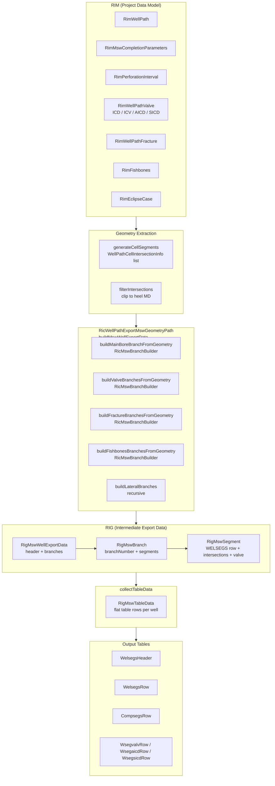

# MSW Export: High-Level Pipeline Overview

```mermaid
flowchart TD
    subgraph RIM["RIM (Project Data Model)"]
        WP[RimWellPath]
        MSW[RimMswCompletionParameters]
        PERF[RimPerforationInterval]
        VALVE["RimWellPathValve<br/>ICD / ICV / AICD / SICD"]
        FRAC[RimWellPathFracture]
        FB[RimFishbones]
        EC[RimEclipseCase]
    end

    subgraph GEO["Geometry Extraction"]
        GCS["generateCellSegments<br/>WellPathCellIntersectionInfo list"]
        FI["filterIntersections<br/>clip to heel MD"]
    end

    subgraph BUILD["RicWellPathExportMswGeometryPath<br/>buildMswWellExportData"]
        MB["buildMainBoreBranchFromGeometry<br/>RicMswBranchBuilder"]
        VB["buildValveBranchesFromGeometry<br/>RicMswBranchBuilder"]
        FRB["buildFractureBranchesFromGeometry<br/>RicMswBranchBuilder"]
        FBB["buildFishbonesBranchesFromGeometry<br/>RicMswBranchBuilder"]
        LAT["buildLateralBranches<br/>recursive"]
    end

    subgraph RIG["RIG (Intermediate Export Data)"]
        WED["RigMswWellExportData<br/>header + branches"]
        BR["RigMswBranch<br/>branchNumber + segments"]
        SEG["RigMswSegment<br/>WELSEGS row + intersections + valve"]
    end

    subgraph COLLECT["collectTableData"]
        TD["RigMswTableData<br/>flat table rows per well"]
    end

    subgraph OUTPUT["Output Tables"]
        WH[WelsegsHeader]
        WR[WelsegsRow]
        CR[CompsegsRow]
        VR["WsegvalvRow / WsegaicdRow / WsegsicdRow"]
    end

    RIM --> GEO
    GEO --> BUILD
    BUILD --> RIG
    RIG --> COLLECT
    COLLECT --> OUTPUT

    WED --> BR --> SEG
```
