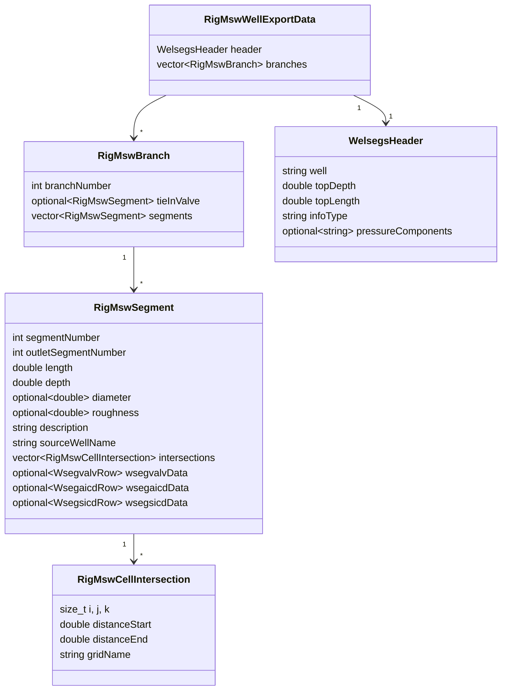
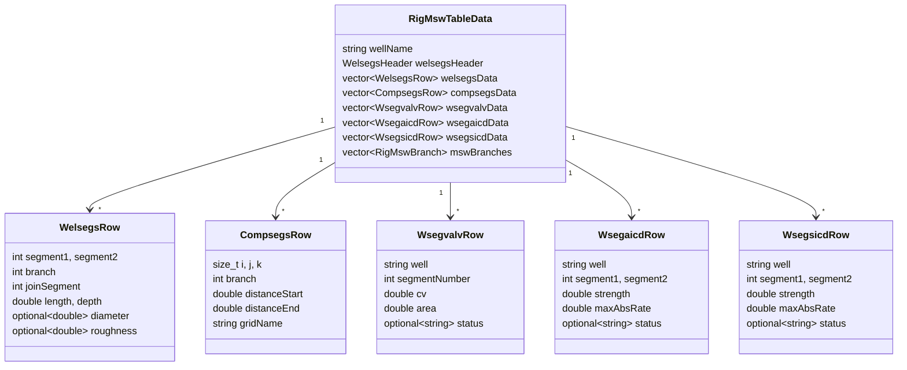
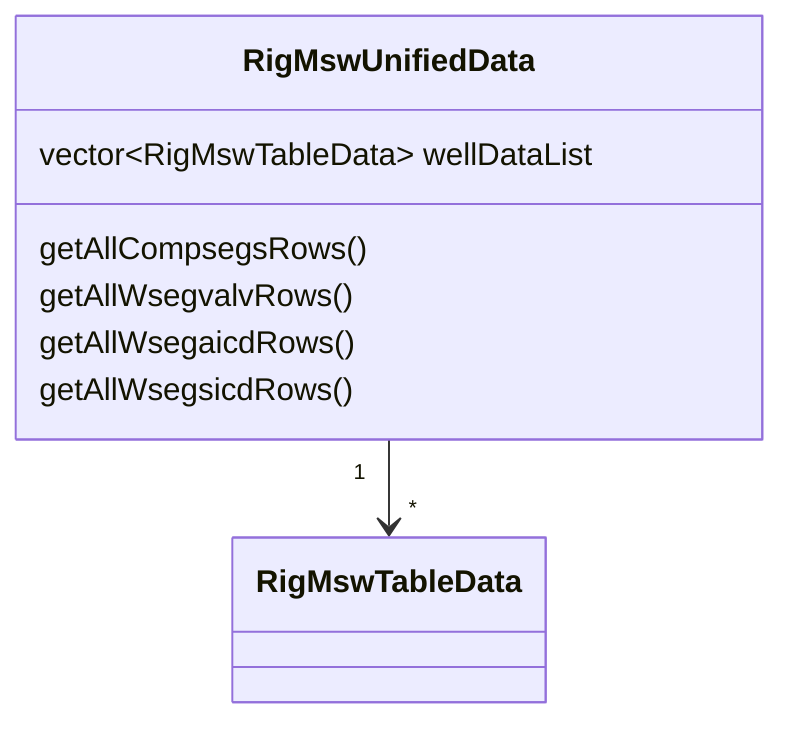

# MSW Export: Data Structures

## RIG flat structs (new geometry path output)

```mermaid
classDiagram
    class RigMswWellExportData {
        WelsegsHeader header
        vector~RigMswBranch~ branches
    }

    class RigMswBranch {
        int branchNumber
        optional~RigMswSegment~ tieInValve
        vector~RigMswSegment~ segments
    }

    class RigMswSegment {
        int segmentNumber
        int outletSegmentNumber
        double length
        double depth
        optional~double~ diameter
        optional~double~ roughness
        string description
        string sourceWellName
        vector~RigMswCellIntersection~ intersections
        optional~WsegvalvRow~ wsegvalvData
        optional~WsegaicdRow~ wsegaicdData
        optional~WsegsicdRow~ wsegsicdData
    }

    class RigMswCellIntersection {
        size_t i, j, k
        double distanceStart
        double distanceEnd
        string gridName
    }

    class WelsegsHeader {
        string well
        double topDepth
        double topLength
        string infoType
        optional~string~ pressureComponents
    }

    RigMswWellExportData "1" --> "1" WelsegsHeader
    RigMswWellExportData "1" --> "*" RigMswBranch
    RigMswBranch "1" --> "*" RigMswSegment
    RigMswSegment "1" --> "*" RigMswCellIntersection
```

## Flat table rows collected into RigMswTableData

```mermaid
classDiagram
    class RigMswTableData {
        string wellName
        WelsegsHeader welsegsHeader
        vector~WelsegsRow~ welsegsData
        vector~CompsegsRow~ compsegsData
        vector~WsegvalvRow~ wsegvalvData
        vector~WsegaicdRow~ wsegaicdData
        vector~WsegsicdRow~ wsegsicdData
        vector~RigMswBranch~ mswBranches
    }

    class WelsegsRow {
        int segment1, segment2
        int branch
        int joinSegment
        double length, depth
        optional~double~ diameter
        optional~double~ roughness
    }

    class CompsegsRow {
        size_t i, j, k
        int branch
        double distanceStart
        double distanceEnd
        string gridName
    }

    class WsegvalvRow {
        string well
        int segmentNumber
        double cv
        double area
        optional~string~ status
    }

    class WsegaicdRow {
        string well
        int segment1, segment2
        double strength
        double maxAbsRate
        optional~string~ status
    }

    class WsegsicdRow {
        string well
        int segment1, segment2
        double strength
        double maxAbsRate
        optional~string~ status
    }

    RigMswTableData "1" --> "*" WelsegsRow
    RigMswTableData "1" --> "*" CompsegsRow
    RigMswTableData "1" --> "*" WsegvalvRow
    RigMswTableData "1" --> "*" WsegaicdRow
    RigMswTableData "1" --> "*" WsegsicdRow
```

## RigMswUnifiedData aggregates multiple wells

```mermaid
classDiagram
    class RigMswUnifiedData {
        vector~RigMswTableData~ wellDataList
        getAllCompsegsRows()
        getAllWsegvalvRows()
        getAllWsegaicdRows()
        getAllWsegsicdRows()
    }

    RigMswUnifiedData "1" --> "*" RigMswTableData
```
