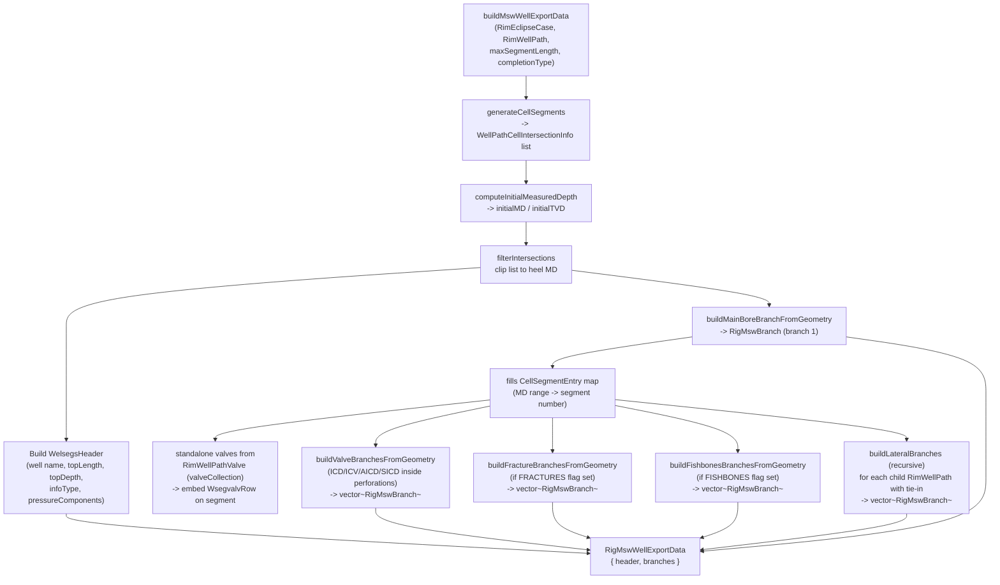
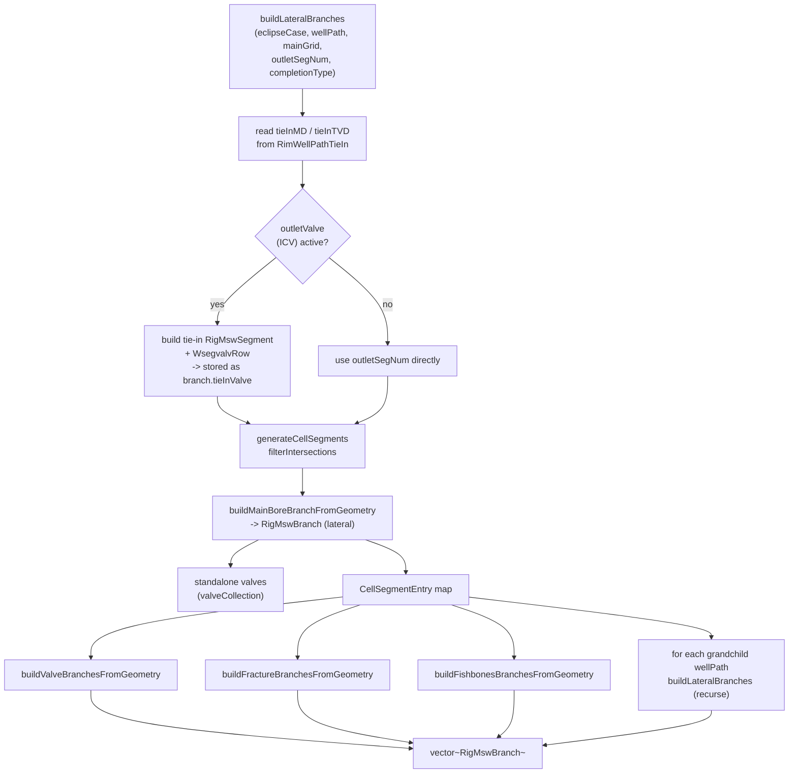
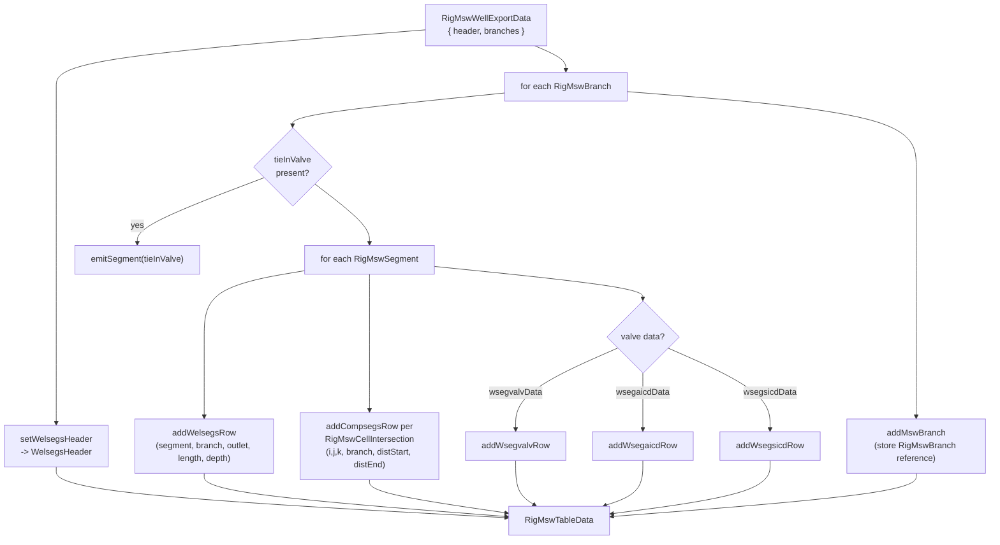

# MSW Export: Detailed Build Pipeline

## buildMswWellExportData — main bore + completions

## buildLateralBranches — recursive lateral handling

## collectTableData — RigMswWellExportData to RigMswTableData

