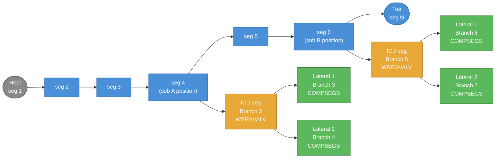
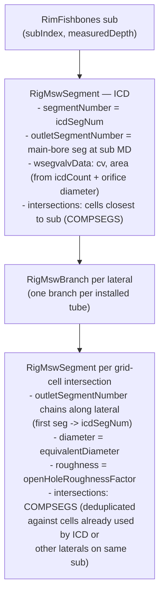

# Fishbones MSW Model

## Well path layout

Each fishbones "sub" position on the main bore spawns one ICD branch and one
lateral branch per installed tube. All segments belong to `RigMswBranch`
structs; connectivity is expressed through `outletSegmentNumber`.

```
Heel (seg 1)
  |
  |  Branch 1 — main bore
  |
  o--[seg 2]--[seg 3]--[seg 4]--[seg 5]--[seg 6]-- ... --[seg N]-- Toe
                 |                  |
             Sub position       Sub position
                 |                  |
            [ICD seg]           [ICD seg]        <- Branch 2, 5, ...  (one per sub)
            (WSEGVALV)          (WSEGVALV)
             /     \             /     \
       [lat seg] [lat seg]  [lat seg] [lat seg]  <- Branch 3/4, 6/7, ... (one per lateral)
       COMPSEGS  COMPSEGS   COMPSEGS  COMPSEGS
```

## Branch and segment hierarchy



## Per-sub data structure



## Outlet segment lookup

The ICD segment outlet is found with `findOutletSegmentForMD`:

```
cellSegMap (built during main-bore pass):

  [startMD ---- midpoint ---- endMD] -> lastSubSegmentNumber
  [  200.0 ---- 212.5 ----  225.0 ] -> seg 3
  [  225.0 ---- 237.5 ----  250.0 ] -> seg 4   <- sub A at MD 243 connects here
  [  250.0 ---- 262.5 ----  275.0 ] -> seg 5
  [  275.0 ---- 287.5 ----  300.0 ] -> seg 6   <- sub B at MD 290 connects here

Rule: pick the entry whose midpoint is closest to, but not greater than, the sub MD.
```
